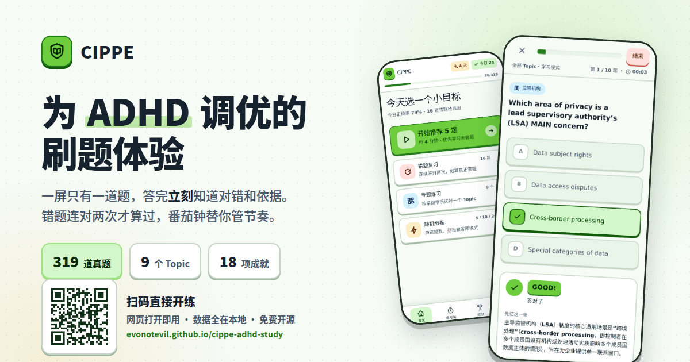
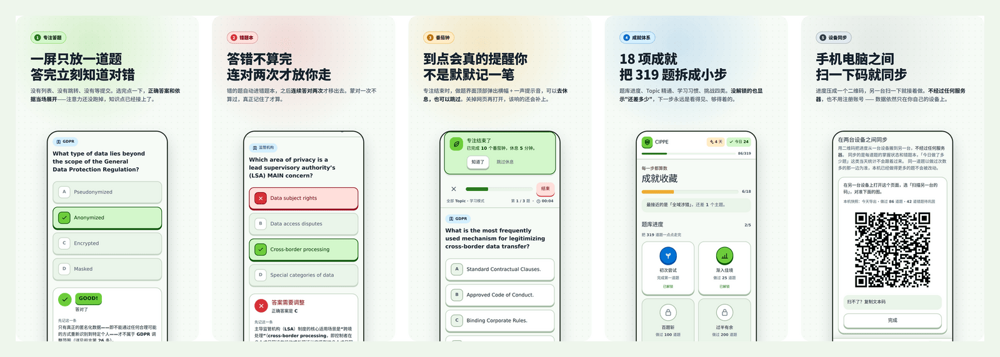

# CIPPE 学习终端

面向 **CIPPE（Certified Information Privacy Professional / Europe）** 备考的刷题工具，针对 ADHD 用户优化。



**线上地址：https://evonotevil.github.io/cippe-adhd-study/**

打开网页就能用，不用注册，不用安装。

---

## 五个核心设计



1. **一屏只放一道题** —— 没有列表、没有跳转、没有等提交。选完点一下，正确答案和依据当场展开。
2. **答错不算完** —— 错题自动进错题本，之后**连续答对两次**才移出去。蒙对一次不算过。
3. **番茄钟真的会提醒** —— 到点在做题界面顶部弹横幅 + 一声提示音，可以去休息也可以跳过。关掉网页再打开，该响的会补上。
4. **18 项成就** —— 题库进度 / Topic 精通 / 学习习惯 / 挑战四类，没解锁的也显示「还差多少」。
5. **扫码同步** —— 手机和电脑之间扫一下二维码就接着做，不经过任何服务器，不用注册账号。

## 完整功能

- **319 道 CIPPE 真题**，按 Topic 分类（GDPR、ePrivacy 指令、AI Act、判例法等 9 个主题）
- **四种练习模式**：全库刷题、错题复习、专题练习、随机组卷
- **情景题成组出现**：题库里有 26 组、共 86 道题共用同一段长背景（最长约 3400 字）。
  这些题会连着出，同组第二题起背景自动收起成一行提示，不用把同一段英文读四遍
- **连续答对反馈**：Good（1 连对）/ Nice（2 连对）/ Excellent（3 连对及以上），配分级原创音效
- **学习模式 + 考试模式**（考试模式支持回看、标记、交卷前检查）
- **错题本**：连续答对两次自动移出，跳过不打断连对
- **番茄钟、成就系统**
- **设备同步**：用二维码把进度从一台设备搬到另一台，不经过服务器
- **三套主题**：明亮 / 护眼 / 深色
- **数据导出 / 导入**（JSON 备份，含进度、错题、设置）
- **减少动态效果**支持，键盘可操作，44px 触控目标

## 技术栈

- React 19 + TypeScript + Vite
- Tailwind CSS v4
- Framer Motion
- Web Audio API（无外部音频文件）

## 本地开发

```bash
npm install
npm run dev       # 启动开发服务器
npm run build     # 生产构建，输出到 dist/
npm run lint      # 代码检查
```

辅助脚本（都不参与构建，只在需要时手动跑）：

```bash
npx tsx scripts/gen-scenario-groups.ts   # 重新生成情景题分组表
npx tsx scripts/fix-question-text.ts     # 清理题库里的 PDF 抽取噪音（幂等）
npx tsx scripts/test-sync-code.ts        # 同步编解码与合并的往返测试
```

## 部署

推送到 `main` 即自动发布，无需手动构建。

`.github/workflows/deploy.yml` 会在每次推送时执行 `npm ci && npm run build`，并把
`dist/` 作为 GitHub Pages artifact 发布（Pages 的 Source 设为 GitHub Actions）。
`dist/` 不纳入版本控制，构建产物只在 CI 中生成。

## 数据存储

所有学习进度、错题状态、设置和未完成练习均保存在浏览器 `localStorage`，
可通过「设置 → 导出学习数据」备份为 JSON 文件。**没有账号系统，也没有服务器**。

### 两台设备之间怎么同步

「设置 → 在两台设备之间同步」用二维码点对点传输，同样不经过服务器：

- 传出去的是**每道题的掌握状态**（做过几次、对过几次、连对几次、上次是哪天），
  不是逐次答题流水 —— 满负载压缩后约 400~1000 个字符，一个二维码装得下
- 因此「今日做了多少题」这类当天统计不会跟着过去；错题本、专题进度、成就完整保留
- 合并规则：**同一道题以做过次数多的那一边为准**，次数相同看谁更近。
  本机已经做得更多的题不会被改动，合并前会先告诉你「将更新 N 道、新增 M 道」，事后还能撤销
- 扫不了码的设备（比如没有摄像头的电脑）可以复制粘贴文本码

## 宣传素材

`docs/promo/` 下有主图、五张功能卡和项目二维码，可直接用于分享。
